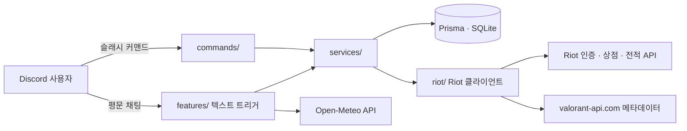
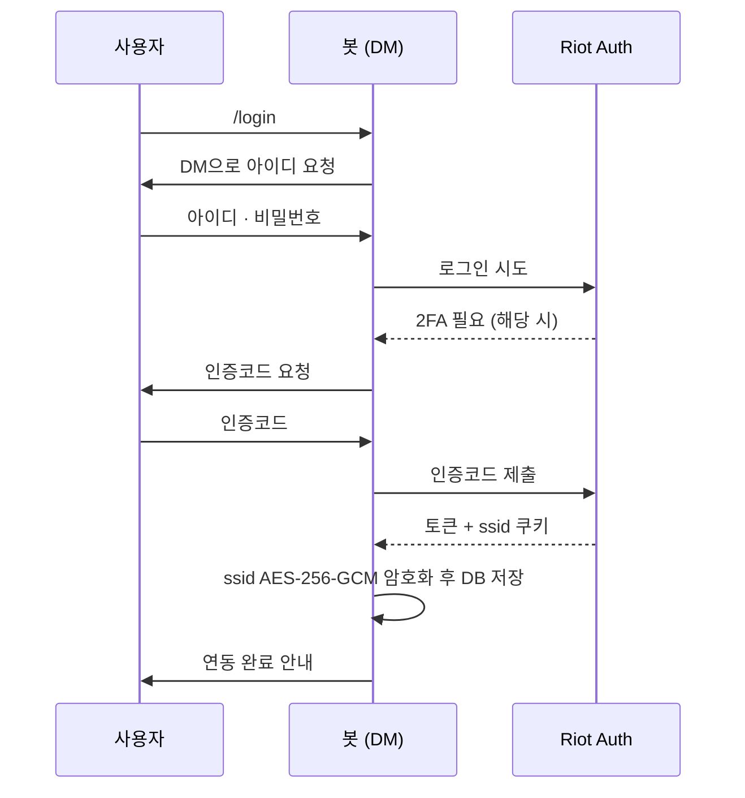

<div align="center">


# 세이지곤듀 (sage-gondyu)

세이지 공주님 컨셉으로 말하는 발로란트 디스코드 봇

[](https://www.typescriptlang.org/)
[](https://nodejs.org/)
[](https://discord.js.org/)
[](https://www.prisma.io/)
[](https://www.sqlite.org/)

</div>

---

> 안녕하세요, 세이지예요. 다들 발로란트 하느라 상점 챙기랴, 전적 확인하랴 바쁘시길래 — 공주가 대신 챙겨드리기로 했어요. 필요하신 건 아래에 순서대로 다 적어뒀으니, 천천히 따라오시면 돼요.

## 목차

- [사용 설명서](#사용-설명서)
- [아키텍처 (개발자 가이드)](#아키텍처-개발자-가이드)
- [시작하기](#시작하기)
- [환경 변수](#환경-변수)
- [프로젝트 구조](#프로젝트-구조)
- [npm 스크립트](#npm-스크립트)
- [보안 원칙](#보안-원칙)
- [알려진 제약](#알려진-제약)

> 💡 상점/위시리스트/전적 조회처럼 진짜 중요한 건 전부 슬래시 커맨드로 만들어뒀고, 날씨나 잡담처럼 가벼운 건 그냥 채팅으로 말 걸면 답해드려요. 채팅으로 말 거는 기능을 쓰려면, 봇을 등록하신 분이 Discord 개발자 포털에서 **Message Content Intent**를 켜주셔야 해요 (기본은 꺼져 있어요).

## 사용 설명서

### 👑 개인 상점 봐드리기

1. `/login` 이라고 쳐주세요. 공주가 바로 DM으로 말을 걸 거예요.
2. DM에서 라이엇 아이디를 알려주세요.
3. 비밀번호도 알려주세요. (알려주시고 나면 그 메시지는 직접 지워주셔야 해요 — 공주는 DM에서 남의 메시지를 지울 힘이 없거든요.)
4. 계정에 2단계 인증이 걸려있다면, 이메일로 받은 인증코드까지 마저 알려주세요.
5. 연동이 끝나면 알려드릴게요. 이제부터 `/shop`이라고만 불러주시면 오늘 상점을 보여드려요.
6. 눈여겨보는 스킨이 있으면 `/wishlist add`로 공주한테 맡겨두세요. 상점에 뜨는 순간 DM으로 제일 먼저 알려드릴게요. (`/wishlist list`로 맡겨둔 것들 확인, `/wishlist remove`로 다시 거둘 수도 있어요.)
7. 계정은 한 분당 3개까지 기억할 수 있어요. `/accounts`로 확인하시고, 필요 없어지면 `/logout`으로 놓아드릴게요.

```
👤  /shop

👑 오늘의 상점
Player#KR1 의 오늘 상점을 보여드릴게요 · 다음 갱신 3시간 뒤
• 정예 사냥꾼 뱀파이어 카드
• 프렐루드 투 카오스
• 라이징 세이버 고스트
```

### 🎯 전적 살펴보기

이건 로그인 안 하셔도 돼요. 닉네임#태그만 알려주시면 아무나 살펴봐드려요.

1. `/rank Player#KR1` 이라고 해보세요. 지금 티어랑 RR을 알려드릴게요.
2. `/matches Player#KR1` 이라고 하면 최근 전적을 보여드려요. `count` 옵션으로 몇 판까지 볼지 정할 수 있어요 (최대 10판).
3. 만약 "아직 전적을 봐줄 계정이 없는걸요"라고 하면, 서버 관리자님이 `/servicelogin`부터 한 번 해주셔야 해요. 한 번만 해두면 다 같이 계속 쓸 수 있어요.

### 💬 그냥 말 걸어도 돼요

슬래시 없이, 채팅창에 그냥 쳐주시면 돼요.

**날씨가 궁금할 때**

```
나         세이지 날씨 서울
세이지     🌤️ 서울특별시 날씨
           대체로 맑음 · 25°C · 습도 41% · 풍속 6.6km/h
```

**공주한테 뭔가 가르쳐주고 싶을 때** — 한 번 가르쳐두면 잊지 않고 기억해드려요. 서버마다 따로 기억하니까 다른 서버 거랑 섞일 걱정은 안 하셔도 돼요.

```
나         세이지 배워 아이스크림 차가워잉
세이지     아이스크림라고 하면 이제 "차가워잉"라고 답할게요!

나         세이지 아이스크림
세이지     차가워잉

나         세이지 잊어 아이스크림
세이지     아이스크림, 이제 깨끗이 잊어드릴게요.
```

**오늘 뭐 먹을지 모르겠을 때** — 다 같이 후보를 보태주시면, 고민될 때마다 하나 골라드릴게요.

```
나         세이지 메뉴 추가 김치찌개
세이지     김치찌개, 오늘의 메뉴 후보로 잘 챙겨둘게요!

나         세이지 오늘의 메뉴
세이지     오늘은 김치찌개 어때요?
```

`세이지 메뉴 목록`이라고 하면 지금까지 뭐가 있는지 다 보여드리고, `세이지 메뉴 삭제 <메뉴>`로 빼드릴 수도 있어요.

| 부르는 말 | 공주가 하는 일 |
| --- | --- |
| `세이지 날씨 <지역>` | 지금 날씨 알려드리기 |
| `세이지 배워 <트리거> <대답>` | 대답 하나 새로 배우기 |
| `세이지 <트리거>` | 배워둔 대답 그대로 말하기 |
| `세이지 잊어 <트리거>` | 배운 대답 잊어드리기 |
| `세이지 메뉴 추가/삭제/목록 <메뉴>` | 메뉴 후보 관리하기 |
| `세이지 오늘의 메뉴` | 후보 중에 하나 골라드리기 |

---

여기부터는 공주를 직접 데려다 키우실(=운영/개발하실) 분들을 위한 내용이에요.

## 아키텍처 (개발자 가이드)



- **commands/** 는 슬래시 커맨드 핸들러, **features/** 는 평문 채팅 트리거. 둘 다 같은 `services/` 레이어를 통해서만 DB와 Riot API에 접근한다.
- **services/** 가 DB ↔ Riot API를 잇는 유일한 통로다. 커맨드/트리거 코드는 Riot API를 직접 호출하지 않는다.
- **riot/** 안의 각 파일은 엔드포인트 하나씩만 담당한다. Riot이 비공식 API 응답 필드를 바꾸면 해당 파일만 고치면 되도록 의도적으로 잘게 쪼개뒀다.

개인 상점 조회는 계정별 세션(`RiotAccount`), 전적 조회는 운영자가 등록한 공용 세션(`ServiceAccount`) — 두 경우 모두 아래처럼 같은 무음 재인증 흐름을 공유한다(`getValidSession`):



이후 상점/전적 조회 시점마다 저장해둔 ssid로 비밀번호 재입력 없이 무음 재인증만 거친다. ssid마저 만료되면 `SessionExpiredError`가 나서 재로그인을 안내한다.

## 시작하기

```bash
npm install
cp .env.example .env       # 값 채우기 — 아래 "환경 변수" 참고
npx prisma migrate dev
npm run deploy-commands    # DISCORD_DEV_GUILD_ID 설정 시 해당 길드에 즉시 반영
npm run dev
```

봇을 처음 띄운 뒤 순서:

1. 운영자가 `/servicelogin` (관리자 전용)으로 전적 조회용 공용 계정을 한 번 등록 → 이후 누구나 `/rank`, `/matches` 사용 가능
2. 각 유저가 `/login`으로 자기 계정을 연동 → `/shop`, `/wishlist` 사용 가능

## 환경 변수

| 변수 | 필수 | 설명 |
| --- | --- | --- |
| `DISCORD_TOKEN` | ✅ | 봇 토큰 |
| `DISCORD_CLIENT_ID` | ✅ | 애플리케이션(클라이언트) ID |
| `DISCORD_DEV_GUILD_ID` | | 개발 중 슬래시 커맨드를 즉시 반영할 길드 ID. 비우면 글로벌 등록(반영까지 최대 1시간) |
| `TOKEN_ENCRYPTION_KEY` | ✅ | 세션 쿠키 암호화용 32바이트 키(hex 64자). `node -e "console.log(require('crypto').randomBytes(32).toString('hex'))"`로 생성 |
| `RIOT_API_KEY` | ✅* | 닉네임#태그 → PUUID 변환(`/rank`, `/matches`)에 사용. 개인 키는 24시간마다 재발급 필요 |
| `DATABASE_URL` | ✅ | SQLite 파일 경로 (기본 `file:./dev.db`) |

\* 전적/랭크 조회 기능을 쓰지 않으면 생략 가능하지만, 봇 자체는 여전히 정상 구동된다.

## 프로젝트 구조

```
src/
  index.ts                    봇 진입점
  deployCommands.ts           슬래시 커맨드 등록 스크립트
  commands/                   슬래시 커맨드 핸들러
    login / logout / accounts / shop / wishlist    개인 상점
    servicelogin / rank / matches                  전적 · 랭크 조회
    princess                                       세이지 공주님을 모시는 방법 (플레이버)
  features/                   평문 채팅 트리거 (재미용, 슬래시 커맨드 아님)
    weatherTrigger.ts             "세이지 날씨 <지역>" → Open-Meteo 날씨 조회
    learnTrigger.ts                "세이지 배워/잊어 <트리거> <대답>", "세이지 <트리거>" → 커스텀 응답 학습
    menuTrigger.ts                 "세이지 메뉴 추가/삭제/목록", "세이지 오늘의 메뉴" → 메뉴 랜덤 추천
    reservedTriggerWords.ts        "세이지 <고정단어>" 예약어 — learnTrigger의 catch-all과 충돌 방지
  riot/                        Riot 인증(비공식) + 상점 · 전적 API 클라이언트, 공식 account-v1 조회
  db/                          Prisma 클라이언트, 암호화 유틸
  services/                    DB ↔ Riot API를 잇는 서비스 레이어
  scheduler/                   계정별 상점 리셋 타이머 및 위시리스트 자동 체크
```

## npm 스크립트

| 명령어 | 설명 |
| --- | --- |
| `npm run dev` | 파일 변경 감지하며 개발 모드로 실행 (`tsx watch`) |
| `npm run build` | TypeScript를 `dist/`로 컴파일 |
| `npm start` | 빌드된 결과 실행 (`node dist/index.js`) |
| `npm run deploy-commands` | 슬래시 커맨드를 Discord에 등록 |
| `npm run prisma:generate` | Prisma 클라이언트 생성 |
| `npm run prisma:migrate` | 마이그레이션 생성 및 적용 |

## 보안 원칙

- 비밀번호는 로그인 절차 중에만 사용하고 저장하지 않는다.
- 재인증용 세션 쿠키만 AES-256-GCM으로 암호화해 DB에 저장한다.
- 로그인 입력(아이디/비밀번호/2FA)은 DM에서만 받는다.
- 전적 조회는 공개 정보이므로 유저 로그인을 요구하지 않는다 — 운영자가 등록한 별도 서비스 계정(`ServiceAccount`) 세션 하나로만 조회하며, 다른 사람 계정 정보를 요구하지 않는다.

## 알려진 제약

- `RIOT_API_KEY`(개인 개발자 키)는 24시간마다 재발급이 필요하다. 서비스로 계속 운영하려면 Riot 프로덕션 키 신청을 고려해야 한다.
- `mmr/v1`, `match-history/v1`, `match-details/v1`, `store/v3`는 전부 Riot이 공식 문서화하지 않은 클라이언트 전용 엔드포인트다. 응답 필드가 바뀌면 해당 파일(`src/riot/*.ts`)만 고치면 되도록 구조를 분리해뒀다.
